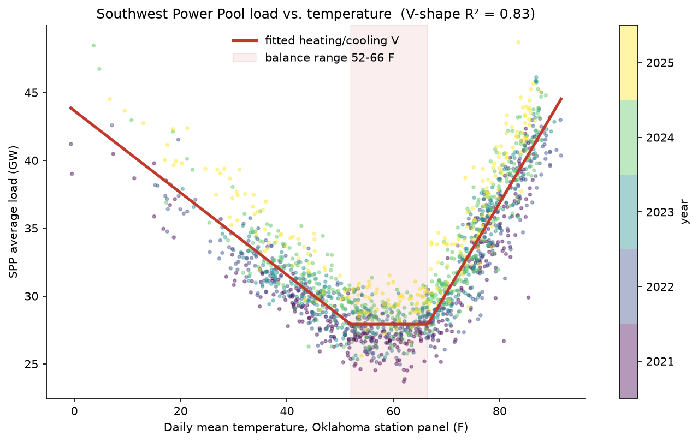
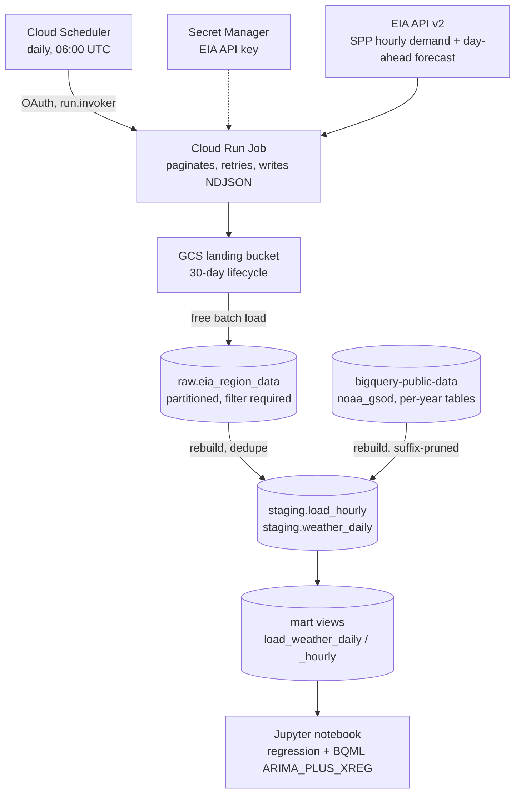

# spp-load-weather

**How much does the weather drive electricity demand on the Southwest Power Pool grid, and can a warehouse-native
model forecast it a day ahead?** Hourly load for the Southwest Power Pool (SPP, the grid operator for Oklahoma,
Kansas, Nebraska and ten other states) from the U.S. Energy Information Administration, joined to NOAA weather
observations and modeled in BigQuery. Every piece of infrastructure is Terraform, and the whole thing runs inside
Google Cloud's free tier; the analysis runs in the BigQuery sandbox, with no billing account at all.



<!-- Headline numbers are written by the notebook's final cell. Paste them here after `make notebook-run`. -->
**Finding:** _pending first run of the notebook._



## What's provisioned

All in [`terraform/`](terraform), as three modules plus a bootstrap:

| Module | Resources |
|---|---|
| [`bootstrap/`](terraform/bootstrap) | `google_storage_bucket` for remote state (versioned), created with local state because a state bucket can't hold its own state |
| [`warehouse`](terraform/modules/warehouse) | `google_bigquery_dataset` ×3 (raw / staging / mart), `google_bigquery_table` (partitioned + clustered tables, views), `google_bigquery_data_transfer_config` (scheduled queries), `google_service_account`, `google_bigquery_dataset_iam_member` |
| [`governance`](terraform/modules/governance) | `google_service_usage_consumer_quota_override` (daily BigQuery byte cap), `google_billing_budget`, `google_monitoring_notification_channel` |
| [`ingestion`](terraform/modules/ingestion) | `google_cloud_run_v2_job`, `google_cloud_scheduler_job`, `google_secret_manager_secret` (+ write-only version), `google_storage_bucket` with lifecycle, `google_artifact_registry_repository` with cleanup policies, two single-purpose `google_service_account`s with scoped IAM |

Design decisions (why Cloud Run Jobs and not Cloud Functions, why daily weather grain, why views instead of
materialized views, and more) are in [`docs/decisions.md`](docs/decisions.md).

## Cost: $0, enforced rather than hoped for

- **The analysis runs in the BigQuery sandbox**, which has no billing account to charge. `sandbox = true` in
  Terraform provisions just the warehouse and matches the sandbox's rules (no DML, 60-day expiry), so every SQL
  file here is a plain `SELECT` written to its table, which the sandbox allows.
- **With billing enabled, a hard daily cap on BigQuery bytes**, set in Terraform: 20 GiB/day, so a month can't exceed the 1 TiB free tier.
  A runaway query fails instead of billing.
- `maximum_bytes_billed` on every query the pipeline and the notebook run, and bytes printed for each one.
- `require_partition_filter` on the raw table, and GSOD's per-year tables pruned with a constant `_TABLE_SUFFIX`.
  The notebook dry-runs the unpruned query to show the difference without paying for it.
- Batch load jobs (free) instead of streaming inserts (billed).
- A $5 budget with alerts at 50/90/100% and on forecast, in case any of the above is wrong.

Details and measured numbers: [`docs/cost.md`](docs/cost.md).

## Run it

Prerequisites: `gcloud` authenticated with application-default credentials, Terraform ≥ 1.11,
[uv](https://docs.astral.sh/uv/), and a free [EIA API key](https://www.eia.gov/opendata/).

**Free, no card** (BigQuery sandbox): create a project at console.cloud.google.com/bigquery, then

```bash
cp terraform/terraform.tfvars.example terraform/terraform.tfvars   # set project_id; sandbox = true
make init-sandbox plan apply   # datasets, tables, views (local Terraform state)
export EIA_API_KEY=...
make backfill                  # five years of SPP load + Oklahoma weather, ~90k rows
make notebook-run              # runs the analysis, saves outputs + the chart
```

Sandbox tables expire after 60 days; `make backfill` rebuilds them in a few minutes. The committed notebook
keeps its outputs regardless.

**With billing** (adds the budget, the daily query cap, scheduled queries, and Phase 2): set `sandbox = false`
plus the billing fields, then `make bootstrap init plan apply` and the same backfill.

Phase 2 (daily automated ingestion, billing only):

```bash
# in terraform.tfvars: enable_ingestion = true, enable_schedules = true
export TF_VAR_eia_api_key=$EIA_API_KEY
make plan apply       # bucket, secret, registry, job (placeholder image), scheduler
make image deploy     # build + push the real image, roll the job onto it
```

`make destroy` removes everything, data included; `make backfill` rebuilds it from the sources.

## Limitations

- **Daily weather against hourly load.** NOAA GSOD station data is daily. The regression runs at daily grain; the
  hourly forecast uses daily temperature as its regressor and gets the within-day shape from seasonality.
- **Oklahoma stations for a 14-state grid.** The temperature panel is a proxy for SPP-wide weather, not a
  population-weighted average across the footprint.
- **The backtest gives the model the observed temperature**, which is a perfect weather forecast. Its comparison
  with EIA's published forecast flatters it; that's stated next to the numbers too.
- **One balancing authority.** EIA revisions older than the ingestion lookback (3 days) are not re-fetched.

## Status

- **Phase 1** (warehouse, backfill, analysis, CI): code complete; runs in the BigQuery sandbox.
- **Phase 2** (scheduled ingestion) and the billing-side cost controls: code complete and validated in CI (fmt,
  validate, tflint, checkov), behind `sandbox = false` and `enable_ingestion`. Not deployed; they need a billing
  account.
