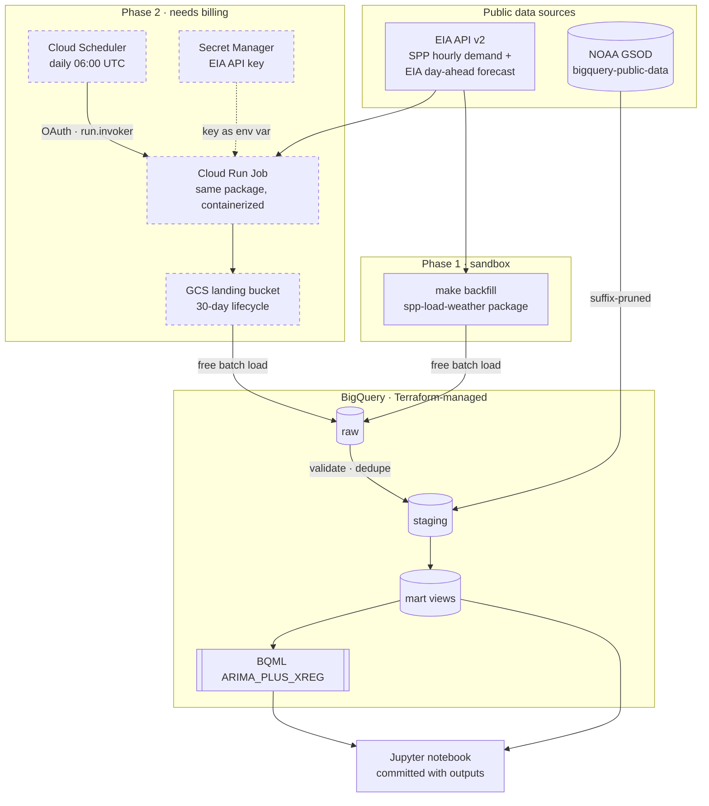
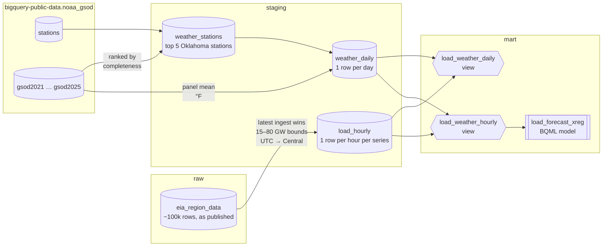
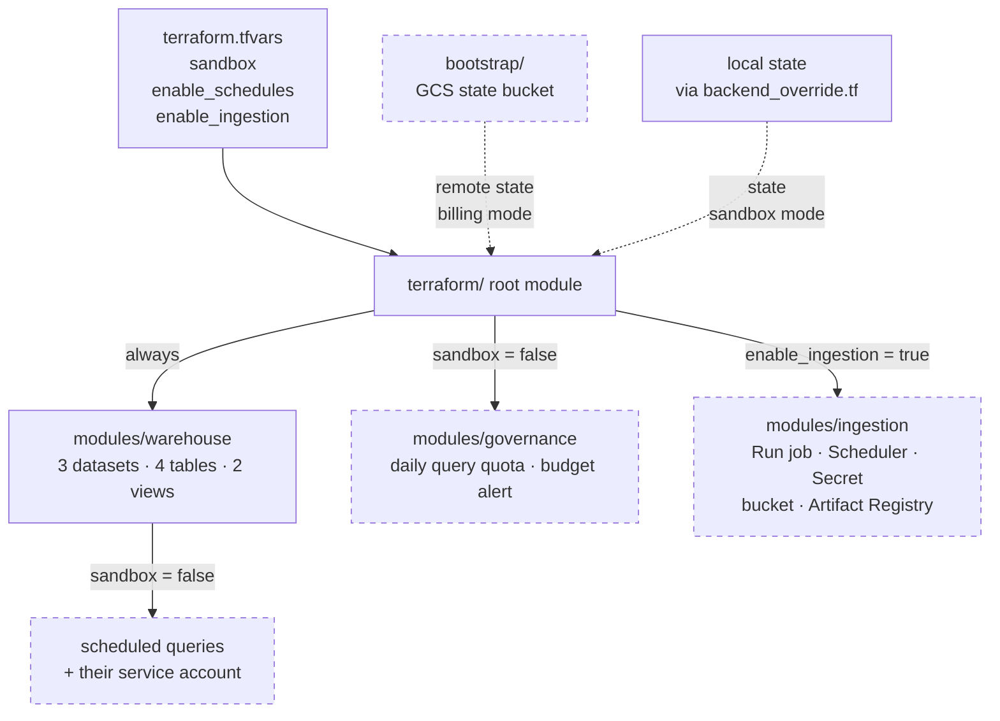
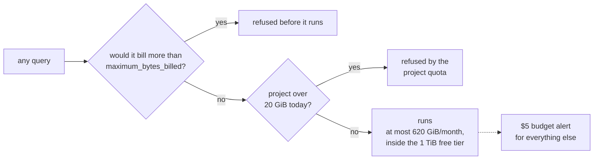
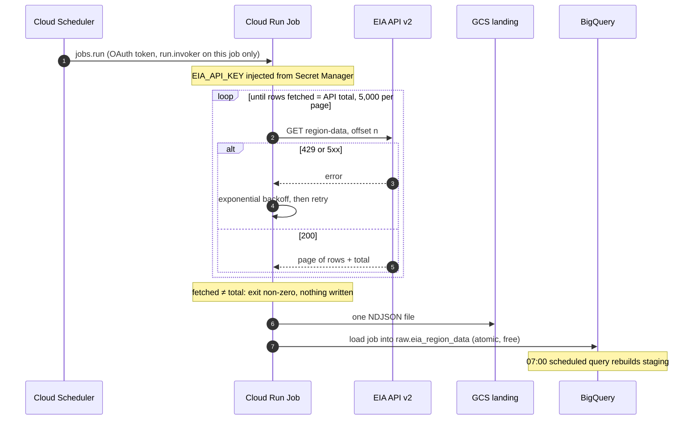
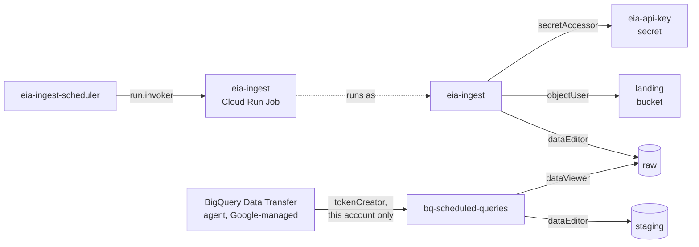

# spp-load-weather

**How much does the weather drive electricity demand on the Southwest Power Pool grid, and can a warehouse-native
model forecast it a day ahead?** Hourly load for the Southwest Power Pool (SPP, the grid operator for Oklahoma,
Kansas, Nebraska and ten other states) from the U.S. Energy Information Administration, joined to NOAA weather
observations and modeled in BigQuery. Every piece of infrastructure is Terraform, and the whole thing runs inside
Google Cloud's free tier; the analysis runs in the BigQuery sandbox, with no billing account at all.


**Findings.** Temperature alone explains **83%** of the day-to-day variation in SPP load, because the
relationship is a V (a straight line explains 12%). Load bottoms out between **52 and 66 °F**, then rises about
**663 MW for every degree of heat**, more than twice the 303 MW per degree of cold below 52 °F. In a day-ahead
backtest over six days in August 2025, BigQuery ML's `ARIMA_PLUS_XREG` scored a **7.8% MAPE**: 68% better than
a seasonal-naive baseline, but short of EIA's own published forecast at **6.6%**.

Full analysis, with every query's cost printed: [`notebooks/01_load_weather_analysis.ipynb`](notebooks/01_load_weather_analysis.ipynb).

## Architecture



Phase 1 runs today in the BigQuery sandbox. Dashed boxes are Phase 2: code complete, but they need a billing
account. Both phases use the same Python package and the same SQL.

## How the data flows



- **raw** keeps every row exactly as EIA published it, append-only, tagged with when it was loaded.
- **staging** is rebuilt from raw on each run: typed, one copy per hour, values outside 15–80 GW rejected (EIA
  publishes the occasional keying error, including one hour of 3.6 million MW), and EIA's hour-ending UTC
  timestamps converted to local Central time.
- **mart** is views, free to keep and never stale, plus the forecast model the notebook trains.

## What's provisioned



| Module | Resources |
|---|---|
| [`bootstrap/`](terraform/bootstrap) | `google_storage_bucket` for remote state (versioned), created with local state because a state bucket can't hold its own state |
| [`warehouse`](terraform/modules/warehouse) | `google_bigquery_dataset` ×3 (raw / staging / mart), `google_bigquery_table` (partitioned + clustered raw table, staging tables, views), `google_bigquery_data_transfer_config` (scheduled queries), `google_service_account`, `google_bigquery_dataset_iam_member` |
| [`governance`](terraform/modules/governance) | `google_service_usage_consumer_quota_override` (daily BigQuery byte cap), `google_billing_budget`, `google_monitoring_notification_channel` |
| [`ingestion`](terraform/modules/ingestion) | `google_cloud_run_v2_job`, `google_cloud_scheduler_job`, `google_secret_manager_secret` (+ write-only version), `google_storage_bucket` with lifecycle, `google_artifact_registry_repository` with cleanup policies, two single-purpose `google_service_account`s with scoped IAM |

Variable validations reject impossible combinations at plan time (for example, scheduled queries in the sandbox,
which has no Data Transfer Service). Design decisions, such as why Cloud Run Jobs and not Cloud Functions, why
daily weather grain, and why views instead of materialized views, are in [`docs/decisions.md`](docs/decisions.md).

## Cost: $0, enforced rather than hoped for



- **The analysis runs in the BigQuery sandbox**, which has no billing account to charge. `sandbox = true` in
  Terraform provisions just the warehouse and matches the sandbox's rules (no DML, 60-day expiry), so every SQL
  file here is a plain `SELECT` written to its table, which the sandbox allows.
- **With billing enabled, a hard daily cap on BigQuery bytes**, set in Terraform: 20 GiB/day, so a month can't
  exceed the 1 TiB free tier. A runaway query fails instead of billing.
- `maximum_bytes_billed` on every query the pipeline and the notebook run, and bytes printed for each one.
- `require_partition_filter` on the raw table, and GSOD's per-year tables pruned with a constant `_TABLE_SUFFIX`.
  The notebook dry-runs the unpruned query to show the difference without paying for it: 6,256 MiB scanned
  without the filter, 654 MiB with it.
- Batch load jobs (free) instead of streaming inserts (billed).
- A $5 budget with alerts at 50/90/100% and on forecast, in case any of the above is wrong.

Details and measured numbers: [`docs/cost.md`](docs/cost.md).

## Run it

Prerequisites: `gcloud` authenticated with application-default credentials, Terraform ≥ 1.11,
[uv](https://docs.astral.sh/uv/), and a free [EIA API key](https://www.eia.gov/opendata/).

**Free, no card** (BigQuery sandbox): create a project at console.cloud.google.com/bigquery, then

```bash
cp terraform/terraform.tfvars.example terraform/terraform.tfvars   # set project_id; sandbox = true
make init-sandbox plan apply   # datasets, tables, views (local Terraform state)
export EIA_API_KEY=...
make backfill                  # five years of SPP load + Oklahoma weather, ~100k rows
make notebook-run              # runs the analysis, saves outputs + the chart
```

Sandbox tables expire after 60 days; `make backfill` rebuilds them in a few minutes. The committed notebook
keeps its outputs regardless.

**With billing** (adds the budget, the daily query cap, scheduled queries, and Phase 2): set `sandbox = false`
plus the billing fields, then `make bootstrap init plan apply` and the same backfill.

Phase 2 (daily automated ingestion, billing only):

```bash
# in terraform.tfvars: enable_ingestion = true, enable_schedules = true
export TF_VAR_eia_api_key=$EIA_API_KEY
make plan apply       # bucket, secret, registry, job (placeholder image), scheduler
make image deploy     # build + push the real image, roll the job onto it
```

`make destroy` removes everything, data included; `make backfill` rebuilds it from the sources.

<details>
<summary><b>Phase 2: one daily ingestion run, step by step</b></summary>



Each run re-fetches the last 3 days because EIA revises recent hours. Raw keeps both copies; staging keeps the
newest, so re-running any window never duplicates a row.

</details>

<details>
<summary><b>Phase 2: who can touch what</b></summary>



Every grant is on a single resource except `bigquery.jobUser`, which both workload accounts hold at project level
because BigQuery jobs run at project scope. The ingestion job can't read staging or mart; the scheduled queries
can't write raw.

</details>

## Limitations

- **Daily weather against hourly load.** NOAA GSOD station data is daily. The regression runs at daily grain; the
  hourly forecast uses daily temperature as its regressor and gets the within-day shape from seasonality.
- **Oklahoma stations for a 14-state grid.** The temperature panel is a proxy for SPP-wide weather, not a
  population-weighted average across the footprint.
- **The backtest gives the model the observed temperature**, which is a perfect weather forecast. Its comparison
  with EIA's published forecast flatters it; that's stated next to the numbers too.
- **Weather ends 2025-08-28.** The BigQuery public copy of NOAA GSOD stopped updating then (there is no
  `gsod2026` table as of September 2026), so the analysis window is 2021-01-01 to 2025-08-28, about 1,700 days.
  Load data runs to the present. A live Phase 2 would need weather straight from NOAA.
- **One balancing authority.** EIA revisions older than the ingestion lookback (3 days) are not re-fetched.

## Status

- **Phase 1** (warehouse, backfill, analysis, CI): done. Running in the BigQuery sandbox; the notebook is
  committed with its outputs.
- **Phase 2** (scheduled ingestion) and the billing-side cost controls: code complete and validated in CI (fmt,
  validate, tflint, checkov), behind `sandbox = false` and `enable_ingestion`. Not deployed; they need a billing
  account.
